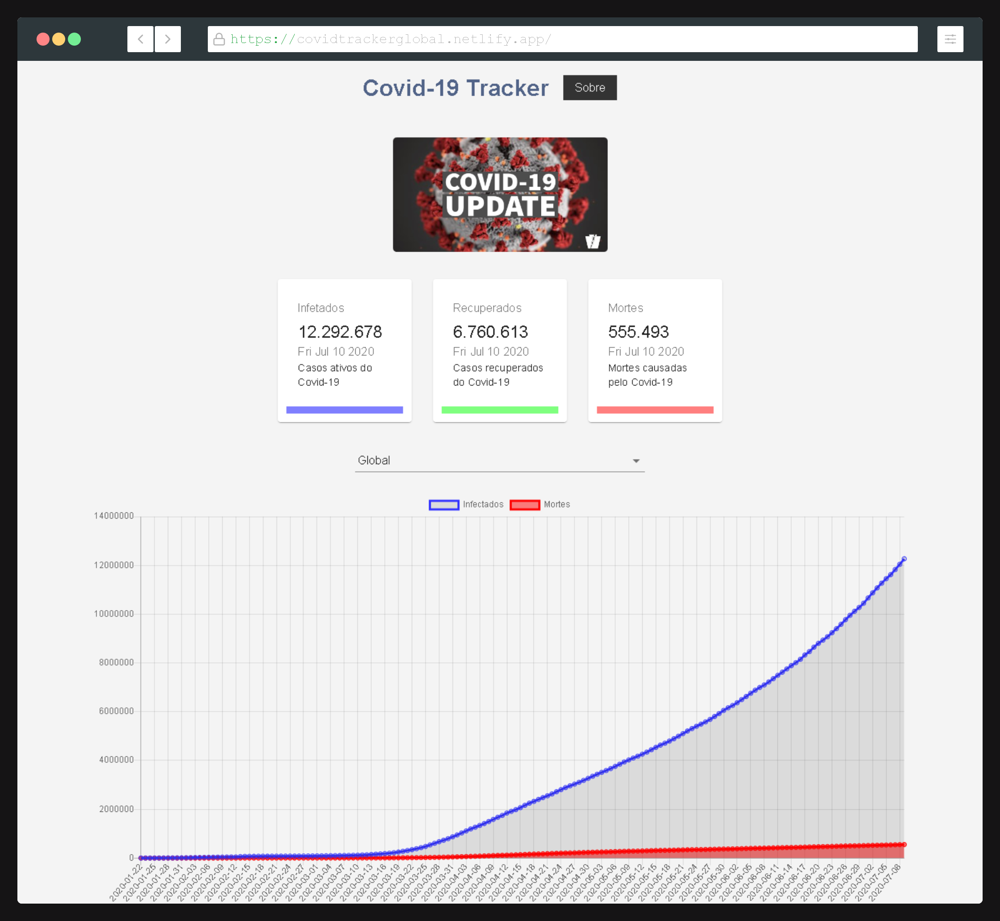
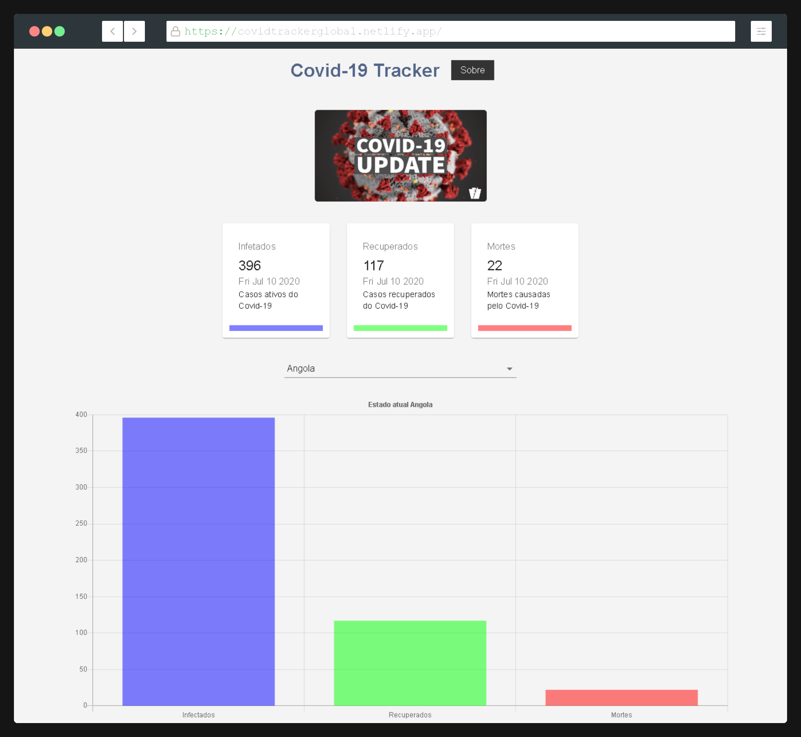

<h1 align="center">
 
  
 
 
  Covid-Tracker
</h1>

Covid-tracker é uma app web que informa sobre os casos de Covid no mundo todo.

  

[//]: # (Add your gifs/images here:)

  
  

## Features
[//]: # (Add the features of your project here:)
This app features all the latest tools and practices in mobile development!

- ⚛️ **React Js** — A JavaScript library for building user interfaces
- ⚛️ **Axios** — Promise based HTTP client for the browser and node.js 
- ⚛️ **React-Chartjs-2** — React wrapper for Chart.js 

## Getting started

1. Clone this repo using `https://github.com/codder404/covid-tracker.git`
2. Move yourself to the appropriate directory: `cd covid-tracker` 
3. Run `yarn` to install dependencies 

## License

This project is licensed under the MIT License - see the [LICENSE](https://opensource.org/licenses/MIT) page for details.
